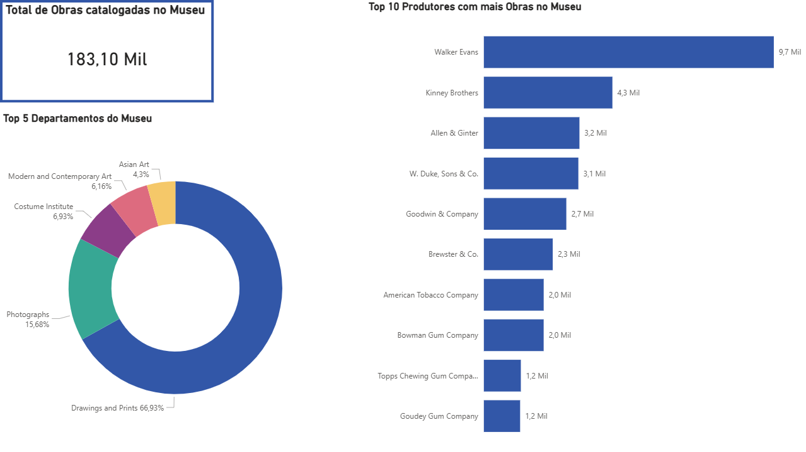

# Análise de Acervo Histórico - The Metropolitan Museum of Art (The Met)

##Visão Geral do Projeto
O objetivo principal foi transformar um grande volume de dados não estruturados em um painel executivo direto e acionável, cobrindo todo o ciclo de vida dos dados: da extração à camada de apresentação visual.

##  Stack Tecnológica
* **Linguagem:** Python
* **Bibliotecas:** Pandas (Tratamento e Limpeza de Dados)
* **Ambiente:** Google Colab
* **Visualização:** Microsoft Power BI
* **Fonte de Dados:** Kaggle (Base oficial em CSV do The Met)

## Arquitetura e Processo (ETL)
1. **Extração:** Coleta da base bruta contendo milhares de registros e mais de 50 colunas de atributos do acervo do museu.
2. **Transformação:** Utilização da biblioteca `Pandas` em Python para:
   * Seleção de colunas estratégicas para o negócio (Departamento, Artista, Tipo de Objeto, etc.).
   * Padronização de nomenclaturas e tratamentos de strings.
   * Limpeza rigorosa de valores nulos e remoção de registros "Unknown/Anonymous" para focar em dados conclusivos.
3. **Carga:** Exportação da base higienizada para um novo formato CSV otimizado para a ferramenta de BI.
4. **Visualização:** Construção de um Dashboard interativo no Power BI utilizando filtros de "Top N" e melhores práticas de Storytelling com Dados e UI/UX.

## 📊 O Dashboard Visual

## Principais Insights Analíticos
Durante a análise exploratória, os dados revelaram padrões fascinantes que vão além do senso comum sobre um museu de arte:

1. **A Anomalia do Tabaco:** Ao analisar o *Top 10 Produtores com mais obras*, nota-se a ausência de pintores clássicos no topo da lista. Em vez disso, gigantes como *Walker Evans*, *Kinney Brothers* e *American Tobacco Company* lideram o acervo. 
2. **O Motivo:** Isso ocorre porque o museu detém uma das maiores coleções históricas de *Trading Cards* (cartões colecionáveis litografados) do mundo, que eram distribuídos dentro de maços de cigarro na virada do século XX.
3. **Concentração de Departamentos:** Essa enorme quantidade de material impresso justifica por que o departamento de **"Drawings and Prints"** domina quase 67% de todas as obras catalogadas e validadas na base de dados, ofuscando áreas clássicas como Pinturas Europeias ou Arte Asiática.
